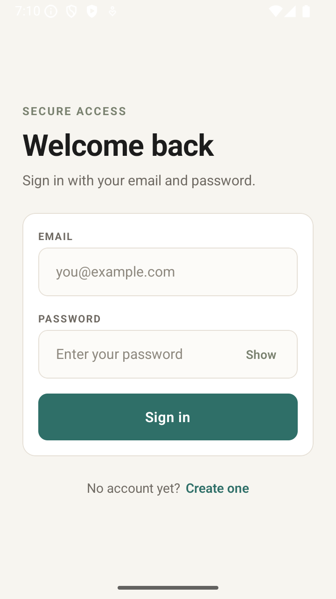
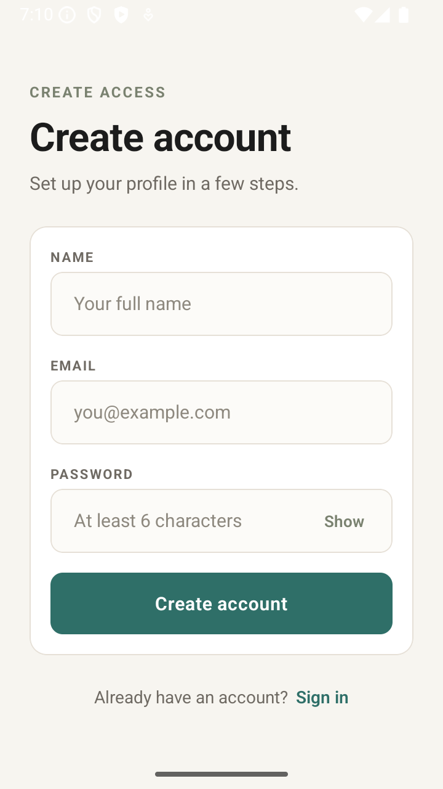
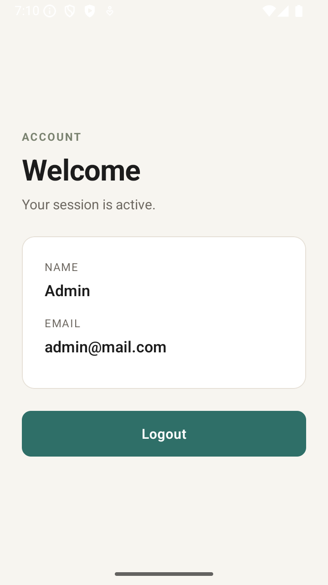

# User Authentication App

I built this app as an interview assessment to demonstrate a clean authentication flow in React Native with Expo.
It includes login, signup, home routing, form validation, persisted session state, and a minimalist UI.

## Screenshots




## Tech Stack

- Expo + React Native
- TypeScript
- React Navigation
- React Hook Form + Zod
- MMKV for local persistence
- Fetch API for networking

## How To Run

This project is set up for **Windows + Android** or **macOS + iOS**.

### 1) Install dependencies

```bash
npm install
```

### 2) Create your env file

```bash
copy .env.example .env
```

### 3) Generate the Android native project

```bash
npx expo prebuild -p android
```

### 4) Run the app

#### Android

```bash
npm run android
```

#### iOS (macOS only)

```bash
npm run ios
```

If Metro is not already running, start it in dev-client mode:

```bash
npm run start
```

## What I Implemented

- Login screen with email/password validation
- Signup screen with name/email/password validation
- Home screen showing the signed-in user
- Context-based auth state management
- MMKV session persistence
- Free backend integration using `api.escuelajs.co`
- Password visibility toggle
- Minimalist UI styling

## Test Account

You can use this existing account to test the login flow:

- Email: `admin@mail.com`
- Password: `admin123`

## Notes

- This app uses `react-native-mmkv`, so it does **not** run in Expo Go.
- Use an Expo dev client / native Android build.
- The API base URL can be changed with `EXPO_PUBLIC_API_URL`.
- App scheme: `kloudiustest`

## Why MMKV

I used MMKV instead of AsyncStorage because it is faster, lightweight, and better suited for responsive local session storage in React Native.
For this app, I wanted persistence that feels instant while still keeping the code simple.

## Next Improvements

- Add test coverage
- Add smoother screen transitions
- Add encrypted MMKV storage (expo-secure-storage)
